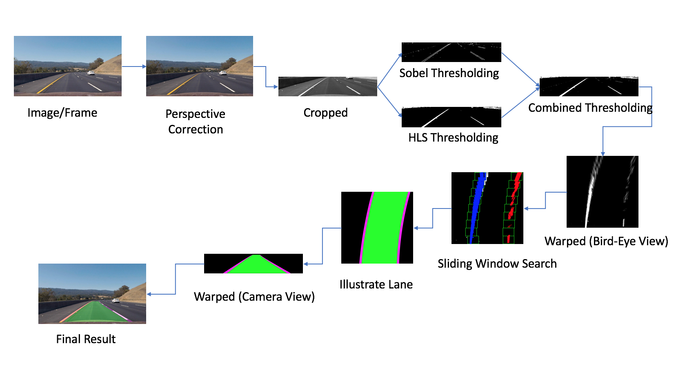

# Advanced Lane Detection for Self-Driving Cars

  
> ***Click the GIF abobe for link to YouTube video of the result***

---

### Dependencies:
* Python 3.5.x
* NumPy
* CV2
* matplotlib
* glob
* PIL
* moviepy

### Objectives:

* Compute the camera calibration matrix and distortion coefficients using a set of chessboard images.
* Apply a distortion correction to video frames.
* Use color transforms, gradients, to create a thresholded binary image.
* Apply a perspective transform to rectify binary image ("birds-eye view").
* Detect lane pixels and fit to find the lane boundary.
* Determine the curvature of the lane and vehicle position with respect to center.
* Warp the detected lane boundaries back onto the original image.
* Output visual display of the lane boundaries and numerical estimation of lane curvature and vehicle position.

[//]: # (Image/Video/Code File References)

[image1]: ./output_images/undistort_output.png "Undistorted"
[image1b]: ./output_images/undistort_road_output.png "Undistorted"
[image2b]: ./output_images/cropped_road.png "Cropped"
[image2c]: ./output_images/combined_thresholding.png "Thresholding"
[image2d]: ./output_images/birdseyeview.png "Bird's Eye View"
[image2e]: ./output_images/sliding_window.png "Sliding Window Search"
[polynomial]: ./output_images/polynomial.png "Polynomial"
[FitPoly]: ./output_images/color_fit_lines.jpg "Fit Polynomial"
[input_img]: ./test_images/test3.jpg "Input Image"
[image3]: ./examples/binary_combo_example.jpg "Binary Example"
[image4]: ./output_images/warped_straight_lines.jpg "Warp Example"
[image5]: ./examples/color_fit_lines.jpg "Fit Visual"
[image6]: ./examples/example_output.jpg "Output"

[video_in]: ./project_video.mp4 "Video"
[video_out]: ./output_videos/video_out_track1.mp4 "Track 1 Video"

[gif_track1]:   ./output_videos/gif_out_track1.gif "Track 1 GIF"

[calib1]: ./test_images/calibration1.jpg "Chessboard"
[calib_chesss]: ./output_images/undist_img_calibration1.png "Calibration Chessboard"
[01_calib_road]: ./output_images/01_undist_img.png "Calibration Road"
[02_cropped]: ./output_images/02_cropped.png "Cropped Road"
[03_sobel_thresh]: ./output_images/03_combined_gradient_img.png "Sobel Threshold"
[04_hls_thresh]: ./output_images/04_combined_hls_img.png "HLS Threshold"
[05_combined_thresh]: ./output_images/05_combined_thresh_result_img.png "Combined Threshold"
[07_warped]: ./output_images/07_warped_img.png "Warped Thresholded"
[08_sliding_window]: ./output_images/08_searching_img.png "Sliding Window"
[10_lane_illustration]: ./output_images/10_w_color_result_img.png "Lane Illustration"
[11_lane_rewarped]: ./output_images/11_color_result.png "Original Perspective"
[13_result]: ./output_images/13_final_result.png "Result"
[gui_demo]: ./gui_tool_demo/ezgif_com-video-to-gif.gif "Parameter Tuner GUI Tool"

### Implementation Details:

[`camera_calibration.py`](camera_calibration.py) : To calculate Calibration Matrix  
[`line.py`](line.py) : Line class, contains functions to detect lane lines  
[`threshold.py`](threshold.py) : Contains functions for thresholding an image  
[`process.py`](process.py) : Contains the image processing pipeline and main function  
[`find_parameters.py`](find_parameters.py) : Run GUI tool to find right parameters for various inputs  
[`guiutils.py`](guiutils.py) : GUI builder class

---

### Pipeline 

     
    <b>[Pipeline for detecting Lanes]</b> 

---

### 1. Camera Calibration
The camera that is being used may have distortion, which can cause erros in calculations. So we first need to calibrate the camera and calculate the calibration matrix. Camera looks at World-Points (3D) and converts them to Image-Points (2D). Using some chessboard images, that would have predictable patterns, I am calibrating the camera.   
The code for camera calibration step is contained in the [`camera_calibration.py`](camera_calibration.py).  

I start by preparing "object points", which will be the (x, y, z) coordinates of the chessboard corners in the world. Here I am assuming the chessboard is fixed on the (x, y) plane at z=0, such that the object points are the same for each calibration image.  Thus, `objp` is just a replicated array of coordinates, and `objpoints` will be appended with a copy of it every time I successfully detect all chessboard corners in a test image.  `imgpoints` will be appended with the (x, y) pixel position of each of the corners in the image plane with each successful chessboard detection.  

I then used the output `objpoints` and `imgpoints` to compute the camera calibration and distortion coefficients using the `cv2.calibrateCamera()` function.  I applied this distortion correction to the test image using the `cv2.undistort()` function and obtained this result: 

![Undistorted Chessboard][image1]
![Undistorted Road][image1b]

### 2. Perspective Transform
Objects appear smaller, the farther they are from view point and parallel lines seem to converge to a point when we project the 3D points to camera's 2D points. 
This phenomenon needs to be taken into account when trying to find parallel lines of a lane. With perspective transform, we can transform road image to a bird-eye view image, in which, it is easier to detect the curving angles of lanes.  
The code for Perspective Transformation is contain in the [`line.py`](line.py).

Below is the outcome of perspective transform:  

![Perspective Transform][image4]

### 3. Cropping
For the purpose of detecting lane lines, we only need to focus on the regions where we are likely to see the lanes. For this reason, I am cropping the image and doing the further image processing only on certain regions of the image. I also resize the image to smaller dimensions. This helps with making the image processing pipeline faster. 

Below is the outcome of cropping the image.

![Cropped][image2b]

### 4. Thresholding
I used two methods of thresholding: Gradient Thresholing & HLS Thresholding.  

I used Sobel Kernel for gradient thresholding in both X and Y directions. Since lane lines are likely to be vertical, I put more weight on the gradient in Y direction. I took absolute gradient values and normalized them for appropriate scaling.  

In addition, I used HLS color channel, to handle cases when the road color is too bright or too light. I discarted L channel, which contains the information about Lightness (bright or dark), and put more emphasis on H and L channels. This way I could eliminate the lightness of the pixel out of the equation.  

Then I combined both of the Gradient and HLS (color) threshoding into one for the final thresholded binary image. The code for this thresholding approach is contained in the [`threshold.py`](threshold.py). 

Below is the outcome of thresholding:  

![Combined Thresholding][image2c]

### 5. Birds-Eye View
When we do perspective transform (as discussed above), we can get birds-eye view. In the example shown above, the road is a flat plane. This isn't strictly true, but we can still get a good approximation. I take 4 points in a trapezoidal shape that would represent a rectangle when looking down from road above.
This allows use to eliminate the phenomenon by which the parallel lines seem to converge to a single point. In Birds-Eye View, we can view the lane lines as actual parallel lines.

The code for this is contained in the [`line.py`](line.py).

Below is the outcome of transforming road to birds-eye view perspective:  

![Birds-Eye View][image2d]

*As we can see, it is very difficult to see in camera-view that the lane is curving to the right. However, in Birds-Eye view, we can easily detect that the parallel lane lines are curving to right few meters ahead.*
 

### 6. Sliding Window Search
Once we have already detected lane lines in an earlier frames, we can use that information and use a sliding window, placed around the line centers, to find and follow lane lines from bottom to the top of the image/frame. This allows us to do a highly restricted search and saves a lot of processing time. 
Although, it is not always possible to detect lane lines from the history that is saved in Line class object. So if we lose track of the lines, we ca go back to the method of using thresholding and begin searching lane lines from scratch.  

I do this using two functions: 
* [line_search_reset](https://github.com/maunesh/advanced-lane-detection-for-self-driving-cars/blob/master/line.py#L114)
* [line_search_tracking](https://github.com/maunesh/advanced-lane-detection-for-self-driving-cars/blob/master/line.py#L260)
 

Below is the visualization of Sliding Window search:  

![Slidig Window Search][image2e]

### 7. Radius of the curvature
Now with the located the lane line pixels, we can use their x and y pixel positions, to fit a second order polynomial curve:

![Fit Polynomial][polynomial]

I am fitting for f(y), rather than f(x), because the lane lines in the warped image are nearly vertical and may have the same X value for more than one Y values.

![Fit Polynomial][FitPoly]

###  8. Parameter Tuning
Parameter Tuning is tricky, especially for the challenge video.

In my pipeline, parameters can be tuned in [`process.py`](process.py).

To Update parameters, modify this code: [Parameter Tuning](https://github.com/maunesh/advanced-lane-detection-for-self-driving-cars/blob/master/process.py#L31)

I implemented a GUI tool - similar to the one I had implemented in Basic Lane Line Detection. 
This was very helpful to determine better parameters for the Challenge Video.  The code for this tool is contained in [`guiutils.py`](guiutils.py) and [`find_parameters.py`](find_parameters.py)  

* Below is a demo of the GUI tool:

Here I am trying to determine the correct threshold values for Gradient in X direction and Gradient in Y direction. 

[]

### 9. Illustrating Lane Lines on image/frames
Once we have detected the lane lines, we can illustrate the lane on the current frame/image, by overlaying color pixels on top of the image. 
I am illustrating Lane Lines, Measurement Info and the Birds-Eye View on each frame, using following functions:  
* [illustrate_driving_lane](https://github.com/maunesh/advanced-lane-detection-for-self-driving-cars/blob/master/line.py#L370)
* [illustrate_info_panel](https://github.com/maunesh/advanced-lane-detection-for-self-driving-cars/blob/master/line.py#L471)
* [illustrate_driving_lane_with_topdownview](https://github.com/maunesh/advanced-lane-detection-for-self-driving-cars/blob/master/line.py#L498)

 
With everything combined, when we run the pipeline on an image, we get the follwing image as a final result. 

![Final Result][13_result]

---

## Video Output

#### Project Video:
YouTube Link:     https://youtu.be/Boe5HvpGnMQ 
 

[//]: # (####Challenge Video:)
[//]: # (YouTube Link:     https://youtu.be/clk4ILmAuBw)
[//]: # ( )

---

## Reflection
Getting good results on Harder Challenge Video was very difficult. I did not try Convolution method, but I am leaving it for future experiements. 
I love Computer Vision, but having tried both the *Deep Learning Approach* to drive the car autonomously, and the *Computer Vision Approach* to detect lane lines, the experiece has made me really appreciate the potential of Deep Learning in Self-Driving Car domain. 
